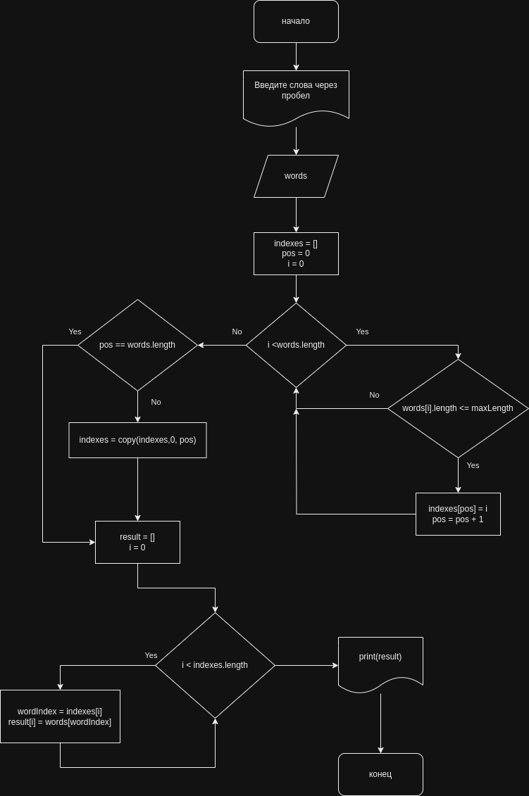

# Итоговая контрольная работа по основному блоку


### Задача: 
Написать программу, которая из имеющегося массива строк формирует новый массив из строк, длина которых меньше, либо равна 3 символам. Первоначальный массив можно ввести с клавиатуры, либо задать на старте выполнения алгоритма. При решении не рекомендуется пользоваться коллекциями, лучше обойтись исключительно массивами.

### Примеры:

```
[“Hello”, “2”, “world”, “:-)”] → [“2”, “:-)”]

[“1234”, “1567”, “-2”, “computer science”] → [“-2”]

[“Russia”, “Denmark”, “Kazan”] → []
```


### Алгоритм
1. Получить массив строк с клавиатуры пользователя
2. Поиск индексов слов с заданой максимальной длинной строки
3. Получение слов по индексам
4. Вывод полученный результат на экран


**GetIndexesWithLength** - содержит логику поиска слов с заданной длинной. Для этого необходимо пройти по всем элементам массива **list** и сравнить длину строки с заданным числом **maxLength**. Для хранения индексов мы инициализировали временный массив **indexes** равный исходному массиву слов, для случая когда все слова в массиве будут удовлетворять условию поиска. Если же количества найденных слов меньше длины исзодного массива **list**, то нам требуется уменьшать размер временного массива индексов. Для этого мы отслеживали позицию **pos**. После чего мы можем создать массив необходимой дляны для хранения индексов и вернуть его из функции.

**GetWordsByIndexes** - задача функции по заданному списк индексов **indexes** получить слова из исходного массива **list**. Для этого мы пробегаем по массиву индексов **indexes** получаем значение индекса и по этому значению достаем из списка **list** слово. Рузультаты последовательно складывем в массив **result** и возвращаем эту перемнную из функции.

**Print** - отвечает за красивый, читаемый формат вывода значений массива на экран пользователя.


### Блок схема



### Примечания:

Программа реализована на языке **C#** и находится в папке **task**

Для запуска программы выполни комманду

```
dotnet run
```
